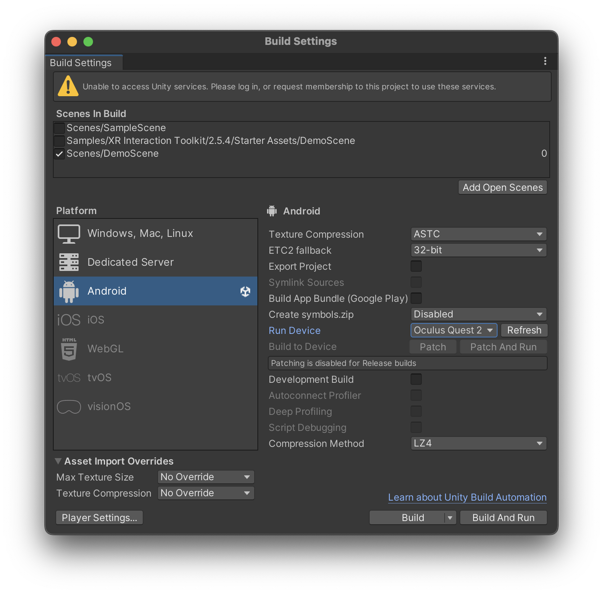

# Group Grey Shirt's repository

This is the repository for Group Grey Shirt's DECO3009 A3 VR experience assignment. As per Unity's official gitignore (see .gitignore) a lot of files have been excluded from being uploaded to here, such as Library and UserSettings. Expect exeptionally long load time upon first launch with Unity

This project will open into an empty scene, this is expected behaviour. Our scene is named "DemoScene", not the one the project defaults to.

This project has only been built and tested on Oculus Quest 2 and 3, the current package removed relavant build settings within the project files. To configure the project build settings to build for quest 2/3, follow [this guide by Meta](https://developer.oculus.com/documentation/unity/unity-build/) or the image below

Thank you!

Alessio, Ross, Guo and Leonard
